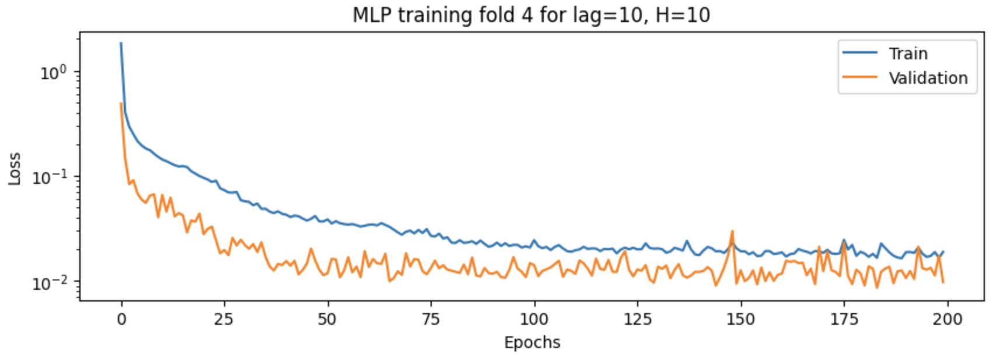
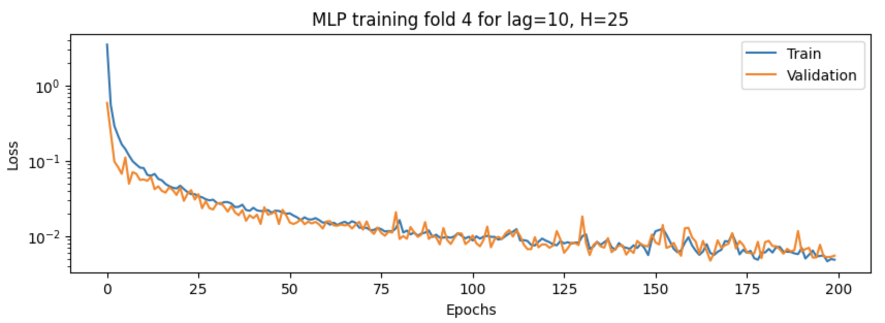

# Artificial Neural Networks and Deep Learning

## 2. Recurrent Nerual Networks

## Section 2.1: Hopfield Network

### Q1. Hopfield network with target patterns [1, 1], [−1, −1] and [1, −1] and the corresponding number of neurons. Simulate finding attractors after a sufficient number of iterations for both Random and High-symmetry input vectors. Evaluate the obtained attractors.

1. **Attractor values**
- **Random Inputs: Attractors vs. Targets**
   

   
    
   <em>Figure: Time evolution in the state space of random input.</em>
   

    - The final states of the random input vectors converge to one of the target patterns (`[1, 1]`, `[-1, -1]`, and `[1, -1]`). 
    - In some cases, the network converges to `[-1, 1]`, which is not one of the original target patterns. This state is known as a spurious state or a false attractor, which is a byproduct of the network's dynamics. It is a result of the symmetric nature of the weights in the Hopfield network, which inherently supports both the target pattern and its inverse as stable states.

    

    
     
    <em>Figure: Energy evolution of the state of random input.</em>
    

- **Symmetric Inputs: Attractors vs. Targets**

   

   
    
   <em>Figure: Time evolution in the state space of symmetric input.</em>
   

    - The final states for symmetric inputs e.g. `[1, 0]`, `[0, 1]`, `[-1, 0]`, and `[0, -1]` are not among the orignal target patterns but ranges between them. The attractors represent states of high symmetry and are sometimes referred to as points of unstable equilibrium in the Hopfield network. 
    - The network does not converge to a specific attractor but rather to a state that is equidistant from multiple attractors. This is especially noticeable in the last case, where the final state `[0, 0]` is exactly in the middle of all the attractors and is essentially an unstable point.
- **Convergence**: 
    - The network typically converges to one of the target patterns or their inverses. In the case of symmetric inputs, the convergence is to states of high symmetry, which are close to multiple attractors.

    

    
     
    <em>Figure: Energy evolution of the state of symmetric input.</em>
    

2. **Unwanted attractors**
- The presence of unwanted attractors such as `[-1, 1]` arises from the interactions between the neurons in the network. The network's energy function has local minima at these points, which are not explicitly trained for but are emergent properties of the network.

3. **Number of iterations to reach the attractor**
- The number of iterations to reach an attractor varies depending on the initial state and the network's energy landscape. For some initial states, convergence may be quick, while for others, especially those starting near the decision boundary between basins of attraction, it may take longer.
    | Input Type        | Average Iterations to Reach Attractor |
    |-------------------|---------------------------------------|
    | Random Inputs     | 10.0                                  |
    | Symmetric Inputs  | 0.0                                   |
- **Random Inputs**: 
    - The number of iterations required for the network to converge to an attractor varies between 1 and 10. The convergence is typically fast, and the network reaches a stable state within a few iterations.
- **Symmetric Inputs**: 
    - The number of iterations required for the network to converge to an attractor is also low, typically between 1 and 10. The convergence is fast, and the network reaches a stable state within a few iterations.

4. **Stability of the attractors**
- The attractors `[1, 1]`, `[-1, -1]`, and `[1, -1]` are stable as they are the intended patterns that the network was trained on. The spurious attractor `[-1, 1]` is also stable, although it is not a desired state.  For symmetric inputs, the network does not converge to the target patterns but rather to intermediate states that are not stable attractors.

### Q2. Hopfield network with target patterns [1, 1, 1], [−1, −1, −1], [1, −1, 1] and the corresponding number of neurons. Simulate finding attractors after a sufficient number of iterations for both Random and High-symmetry input vectors. Evaluate the obtained attractors.

1. **Attractor values**
- **Random Inputs: Attractors vs. Targets**
   

   
    
   <em>Figure: Time evolution in the state space of 3D random input.</em>
   

    - **Final State vs. Target Patterns**: The network converges to states that are either directly one of the target patterns or closely related. This indicates the network's ability to recall the stored patterns from various initial states.
    - **Stability and Recall Accuracy**: The stable final states ([1, -1, -1], [-1, -1, 1], and [1, 1, 1]) match the target patterns, demonstrating the network's associative memory properties. It suggests that these patterns are stable attractors in the network's energy landscape.
    - **Variability in Convergence**: Different initial states lead to convergence to different target patterns, showcasing the network's sensitivity to initial conditions and its capacity to differentiate between distinct attractors.

    

    
     
    <em>Figure: Energy evolution of the state of 3D random input.</em>
    

- **Symmetric Inputs: Attractors vs. Targets**
   

   
    
   <em>Figure: Time evolution in the state space of 3D symmetric input.</em>
   

    - **Near-symmetric States**: The final states for symmetric inputs often don't match exactly with the target patterns. Instead, they are near states of high symmetry, indicating that these inputs are near the boundary regions between the basins of attraction of the target patterns. This phenomenon illustrates the concept of "energy landscape" in Hopfield networks, where certain initial states can lead the network to converge to intermediate states close to multiple attractors.
    - **Stability of Symmetric States**: The appearance of states like [1, 0.06045472, -0.06045472] suggests that these symmetric or near-symmetric inputs do not strongly converge to one specific target pattern but rather to a state influenced by the surrounding attractors. This is particularly notable in a high-dimensional space, where the energy landscape can be complex.

    

    
     
    <em>Figure: Energy evolution of the state of 3D symmetric input.</em>
    

2. **Average Number of Iterations to Reach an Attractor**
    - **Rapid Convergence for Random Inputs**: An average of 10 iterations to reach an attractor for random inputs suggests that the network can quickly stabilize to a memorized pattern from a variety of starting points.
    - **Immediate Convergence for Symmetric Inputs**: The reported average of 0 iterations for symmetric inputs might be misleading or an artifact of how convergence was measured. It likely indicates that these inputs are already very close to or within the basin of attraction of their final states from the beginning.

3. **Overall Interpretation**
    - **Existence of Spurious States**: The appearance of states not directly matching the targets, especially in symmetric simulations, points to the existence of spurious states or mixed states due to the complex interplay of attractors in the network's configuration space.

    In practical terms, these results illustrate the Hopfield network's capabilities and limitations as a content-addressable memory system, its sensitivity to initial states, and the influence of the network's structure on its dynamic behavior.

### Q3.Create a higher dimensional Hopfield network which has as attractors the handwritten digits from 0 to 9. Test the ability of the network to correctly retrieve these patterns when some noisy digits are given as input to the network. Try to answer the below questions by playing with these two parameters:
- noise level represents the level of noise that will corrupt the digits and is a positive number. 
- num iter is the number of iterations the Hopfield network (having as input the noisy digits) will run.
1. **Is the Hopfield model always able to reconstruct the noisy digits? If not why? What is the influence of the noise on the number of iterations?**
    <!-- title of the table: Iteration 50 Noise Level vs. Accuracy -->
    #### Iteration 50 Noise Level vs. Accuracy
    | Noise Level | Accuracy (%) |
    |-------------|--------------|
    | 0.0         | 100.0        |
    | 0.1         | 100.0        |
    | 0.2         | 100.0        |
    | 0.3         | 100.0        |
    | 0.4         | 100.0        |
    | ...         | ...          |
    | 9.6         | 50.0         |
    | 9.7         | 30.0         |
    | 9.8         | 80.0         |
    | 9.9         | 30.0         |
    | 10.0        | 40.0         |

    

    
     
    <em>Figure: Hopfield digit reconstruction with noise on Iteration set to 50.</em>
    

    - **Hopfield Model's Reconstruction Ability**:
        - The Hopfield model is not always able to reconstruct the noisy digits perfectly due to the presence of spurious states and the network's energy landscape. The influence of noise on the number of iterations is significant, as higher noise levels can lead to longer convergence times or even prevent the network from reaching the correct attractor.
        - **Effect of Noise on Reconstruction**: 
            - Low noise levels may allow the network to converge to the correct attractor with minimal distortion. However, as the noise level increases, the network may struggle to recover the original pattern due to the interference caused by the noisy inputs.
            - The network may converge to a spurious state or a mixed state that is a combination of the original pattern and the noise, especially when the noise level is high.
        - **Influence of Noise on Convergence Time**:
            - Higher noise levels can lead to longer convergence times as the network needs more iterations to overcome the noise and reach the correct attractor.
            - The network may get stuck in local minima or oscillate between states when the noise level is high, resulting in prolonged convergence times or failure to converge.
        - **Trade-off between Noise and Convergence**:
            - There is a trade-off between the noise level and the convergence time. Higher noise levels can make it more challenging for the network to reconstruct the original pattern, leading to longer convergence times or convergence to incorrect states.
            - The network's ability to reconstruct the noisy digits depends on the noise level, the network's architecture, and the specific attractors present in the network.

## Section 2.2: Time-Series Prediction with Santa Fe Laser Dataset
### Q1. Implement a time-series prediction MLP network to predict the Santa Fe Laser dataset. Explore the effect of lag, validation size, validation folds, and the number of neurons in the hidden layer on the prediction performance. Discuss the results obtained.

1. **Effect of Lag on Prediction Performance**
    - **Lag Parameter**: The lag parameter determines the number of previous time steps used as input features for the prediction model. A higher lag value captures more historical information but may lead to increased complexity and longer training times.
    - **Impact of Lag on Performance**:
        - **Low Lag Values**: A low lag value may not capture sufficient historical context, leading to poor prediction accuracy and generalization.
        - **Optimal Lag Values**: There exists an optimal lag value that balances the trade-off between capturing relevant information and model complexity. This value can be determined through experimentation and validation.
        - **High Lag Values**: Excessive lag values can introduce noise and irrelevant information, leading to overfitting and reduced prediction performance.
2. **Effect of Validation Size and Folds on Prediction Performance**
    When setting the validation size and the number of validation folds in the context of the `prepare_timeseries` function you've described, you're essentially configuring how to split your time series data into training and validation sets for the purpose of cross-validation. These parameters directly influence the robustness of your model evaluation and the reliability of performance metrics. Let's understand their impact and how to choose them:

    - **Validation Size**:
        - The `validation_size` parameter specifies the size of the validation set. This is often defined as a fraction of the total dataset size. For instance, a `validation_size` of 0.2 means that 20% of the data at the end of the time series will be used for validation, while the remaining 80% will be available for training.
        - Choosing a validation size is a balance between having enough data to train your model effectively and having enough data to validate the model's performance reliably. A common split ratio for time series data is 80/20 or 70/30 (training/validation).

    - **Validation Folds**:
        - The `validation_folds` parameter specifies the number of folds or splits to use in the validation process. 
        - The number of folds is observed to be the number of `available data points` divided by the the `sum` of the `validation size` and the `gap`. The gap is the number of time steps between the training and validation sets.
        - This is relevant for cross-validation, where the model is trained and validated several times, each time with a different fold acting as the validation set and the remaining data used for training.
        - More folds mean more training/validation cycles, which can provide a more accurate estimate of model performance but at the cost of increased computational time and complexity. For time series, the number of folds is often limited by the chronological nature of the data; you cannot randomly shuffle time series data as you might with cross-sectional data without disrupting temporal dependencies.
        - A typical choice might be 5 or 10 folds for cross-validation, but the best choice depends on the size of your dataset and the computational resources at your disposal.

    - **Relationship Between Parameters and Data Size**:
        - The total size of your input data constrains the choices for `validation_size` and `validation_folds`. Specifically, you need enough data points to create meaningful splits. For instance, if you have a very small dataset, using a large number of folds or a very small validation size might not be practical because each individual fold might not contain enough data to be representative or to train the model effectively.
        - It's also essential to consider the "gap" parameter used in time series splitting, corresponding to the lag in your data. The gap ensures that there's a temporal buffer between your training and validation sets, which can affect how you set your validation size and folds.

    - **Recommendations**:
        - Start with standard practices, such as a validation size of 20-30% and 5-10 folds, and adjust based on the performance and specific characteristics of your time series data (e.g., seasonality, length).
        - Ensure your validation set is large enough to capture the key patterns in the data and that each fold in cross-validation has a meaningful amount of data.
        - Remember, the objective is to validate the model's ability to generalize to unseen data effectively, so the settings should reflect the balance between a robust training process and an accurate estimation of performance on new data.

3. **Effect of Number of Neurons in Hidden Layer on Prediction Performance**
    Model performance with different lags and numbers of neurons (hidden units in the MLP) was investigated. Based on a set of lags (e.g., 1, 5, 10, 20) and the number of neurons (e.g., 5, 10, 25, 50), a grid search was performed to evaluate the model's performance, or  mean squared error (MSE), using cross-validation. The results were analyzed to determine the optimal combination of lag and neuron count that yielded the lowest MSE on the test set. The result records are discussed and visualized to understand the influence of each parameter on model performance.

    - **Influence of Neurons on Model Complexity**:
        - **Low Neuron Count**: A low number of neurons may limit the model's capacity to capture complex patterns in the data, potentially leading to underfitting.
        - **Optimal Neuron Count**: There exists an optimal number of neurons that balances model complexity and performance. This value can be determined through experimentation and validation.
        - **High Neuron Count**: Too many neurons can lead to overfitting, where the model learns noise in the training data rather than the underlying patterns, resulting in poor generalization to unseen data.

    - **Interplay Between Lag and Neurons**:
        - The choice of lag and the number of neurons in the hidden layer can interact to influence the model's performance. A larger lag might require more neurons to capture the additional historical context, but this could also introduce noise or irrelevant information. It's essential to balance these aspects effectively to achieve the best predictive performance.

    - **Model Evaluation and Selection**:
        - The grid search approach allows for a systematic evaluation of different combinations of lag and neuron count to identify the best-performing model. By analyzing the results, you can gain insights into how these parameters affect the model's ability to predict the Santa Fe Laser dataset accurately.
        - Visualizing the learning curves, MSE values, and other relevant metrics can provide a comprehensive view of the model's performance and help in selecting the optimal hyperparameters for the MLP network.
        - **Learning Curve without Early Stopping**: 
            

            
             
            <em>Figure: Loss curve: 4 validation folds, 5 lags, 10 hidden units.</em>
            

            

            
             
            <em>Figure: Loss curve: 4 validation folds, 5 lags, 25 hidden units.</em>
            

            

            
             
            <em>Figure: Loss curve: 4 validation folds, 5 lags, 25 hidden units.</em>
            

            

            
             
            <em>Figure: Loss curve: 4 validation folds, 10 lags, 5 hidden units.</em>
            

            

            
             
            <em>Figure: Loss curve: 4 validation folds, 10 lags, 10 hidden units.</em>
            

            

            
             
            <em>Figure: Loss curve: 4 validation folds, 10 lags, 25 hidden units.</em>
            

            

            
             
            <em>Figure: Loss curve: 4 validation folds, 10 lags, 50 hidden units.</em>
            

            

            
             
            <em>Figure: Loss curve: 4 validation folds, 15 lags, 25 hidden units.</em>
            

            

            
             
            <em>Figure: Loss curve: 4 validation folds, 15 lags, 50 hidden units.</em>
            

        - **Learning Curve MSE without Early Stopping**: 
            | Lag | H=5   | H=10  | H=25  | H=50  |
            |-----|-------|-------|-------|-------|
            | 1   | 0.628 | 0.644 | 0.650 | 0.622 |
            | 5   | 0.112 | 0.046 | 0.058 | 0.087 |
            | 10  | 0.180 | 0.068 | 0.176 | 0.205 |
            | 15  | 0.136 | 0.149 | 0.275 | 0.532 |

            - The best performance without early stoping on the validation set is achieved with lag being 5 and H being 10: MSE = 0.046
            - Yet, if with early stoping, the best performance may be achieved with lag 5 and H 25 or 50, or with lag being 10 and H being 25, or at last with lag being 15 and H being 25.
            - Typically, more neurons can capture more complex patterns, but also run the risk of overfitting. Similarly, a larger lag might provide more historical context for predictions, but could also introduce noise or irrelevant information. The best combination will balance these aspects effectively.
            - Consider the trade-offs between model complexity, prediction accuracy, and generalization when selecting the optimal hyperparameters for the MLP network. The goal is to find a model that can effectively predict the Santa Fe Laser dataset while avoiding overfitting or underfitting.

    - **Discussion and Conclusion**:
    #### **Exercise 1**
    Given the learning curve shape, combinations of lag and hidden unit where the training and validation loss converges were selected to predict on test sets. If there is early stopping, despite the lowest MSE without early stopping indicating the combination of lag 5 and H 10 being the best parameter set as lags with higher number in combination with H being 25 or 50 tends to overfit at the end of the epochs, combinatoins of lag being 10 or 15 with H being 25 would perform better than combination of lag being 5 and H being 10 if with early stopping. By evaluating these combinatoin via prediction,  Which combination of parameters gives the best performance (MSE) on the test set?

    - **Lag 5 H 25: The MSE on the test set is: 3908.419**
        

        
         
        <em>Figure: MLP Lag=5 H=25 prediction results on continuation of Santa Fe laser datase .</em>
        

    - **Lag 5 H 50: The MSE on the test set is: 2997.659**
        

        
         
        <em>Figure: MLP Lag=5 H=50 prediction results on continuation of Santa Fe laser datase .</em>
        

    - **Lag 10 H 25: The MSE on the test set is: 3065.473**
        

        
         
        <em>Figure: MLP Lag=10 H=25 prediction results on continuation of Santa Fe laser datase .</em>
        

    - **Lag 15 H 25: The MSE on the test set is: 2940.037**
        

        
         
        <em>Figure: MLP Lag=15 H=25 prediction results on continuation of Santa Fe laser datase .</em>
        

    - **Lag 15 H 50: The MSE on the test set is: 6488.547**
        

        
         
        <em>Figure: MLP Lag=15 H=50 prediction results on continuation of Santa Fe laser datase .</em>
        

### Q2. Do the same for the LSTM model and explain the design process. What is the effect of changing the lag value for the LSTM network?
The LSTM model was implemented to predict the Santa Fe Laser dataset, and the design process involved configuring the model architecture, hyperparameters, and training settings. The impact of changing the lag value on the LSTM network was explored to understand how historical context influences prediction performance.

- Performance on the validation set is achieved with:
    - Lag being 15 and H being 25 performs better on the cross-validatoin set among the lag set of 1, 5, 10, 15 and number of hiddent units set of 5, 10, 25, 50, with MSE on cross-valdiation being the lowest, 0.110.
    - Lag being 15 and H being 25, the MSE on the test set is: 3410.111
        

        
         
        <em>Figure: LSTM Lag=15 H=25 prediction results on continuation of Santa Fe laser datase .</em>
        

### Q3. Compare the results of the recurrent MLP with the LSTM. Which model do you prefer and why?
Both the LSTM and MLP models have been used to predict the continuation of a time series from the Santa Fe laser dataset with the same lag of 15 and number of hidden units at 25.
        

        
         
        <em>Figure: Lag=15 H=25 LSTM vs. MLP prediction results on continuation of Santa Fe laser datase .</em>
        

In comparing the two:

1. **LSTM Results**: The LSTM model appears to track the test data more closely. The peaks and troughs of the predicted values (orange line) follow the test data (blue line) with a higher degree of accuracy, particularly in capturing the rhythm and magnitude of the test data's oscillations.

2. **MLP Results**: The MLP model also captures the overall trend but seems to struggle with the finer details of the test data's fluctuations. It fails to predict the peaks and troughs accurately after about timestep 1060, deviating significantly from the test data.

**Preference**:
Based on the visual comparison, the LSTM model would be preferred for the following reasons:

- **Temporal Dependencies**: LSTMs are specifically designed to handle sequences with long-term dependencies. The LSTM seems to be leveraging its recurrent connections to better remember and predict the sequence of the laser intensity.

- **Prediction Accuracy**: The LSTM's predictions are closer to the test data, suggesting that it is better at generalizing from the training data to predict unseen sequences.

- **Stability**: After timestep 1060, the MLP predictions become erratic and unstable, whereas the LSTM maintains a consistent prediction pattern throughout the entire sequence.

In time series prediction tasks, especially with complex patterns and potential long-term dependencies, LSTMs often outperform traditional MLPs due to their recurrent structure. However, it's also important to consider factors such as training time, computational resources, and the specific characteristics of the dataset when choosing between the two models for practical applications.