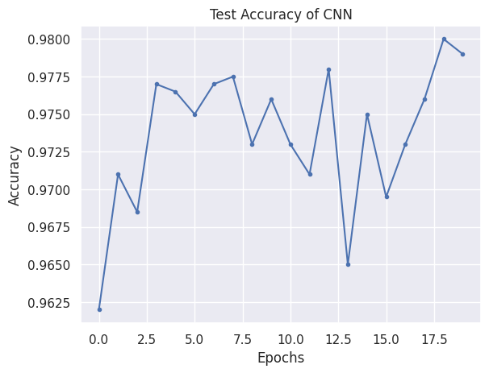
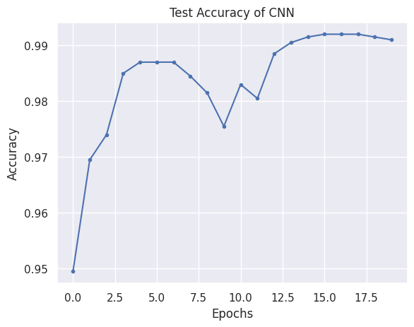

# Artificial Neural Networks and Deep Learning

## 3. Deep Feature Learning 

## Section 3.1: Autoencoders and Stacked Autoencoders

### Q1. Conduct image reconstruction on synthetic handwritten digits dataset (MNIST) using an autoencoder. Note that you can tune the number of neurons in the hidden layer (encoding dim) of the autoencoder and the number of training epochs (n epochs) so as to obtain good reconstruction results. Can you improve the performance of the given model?.

Using a separate validation set for parameter tuning and reserving the test set for final evaluation ensures an unbiased performance measure on unseen data. In the process, training data is split into a new training set (80%) and a validation set (20%), with the latter used for hyperparameter tuning. The model undergoes training on this adjusted training set, validation against the validation set, and is ultimately evaluated on the test set to assess its generalization capability.

Based on the validation set performance given the following hyperparameters configuration:
| Batch Size | Encoding Dimension | Epochs | Average Validation Loss |
|------------|--------------------|--------|-------------------------|
| 16         | 32                 | 40     | 0.017948554020375013    |
| 16         | 32                 | 60     | 0.012706649725635847    |
| 16         | 64                 | 40     | 0.004797367513800661    |
| 16         | 64                 | 60     | 0.005407857708943387    |
| 16         | 128                | 40     | 0.001803275318040202    |
| 16         | 128                | 60     | 0.001841558615056177    |
| 32         | 32                 | 40     | 0.01410618870705366     |
| 32         | 32                 | 60     | 0.013888560553391775    |
| 32         | 64                 | 40     | 0.004698568860068917    |
| 32         | 64                 | 60     | 0.005495807031790415    |
| 32         | 128                | 40     | 0.0017972165880103905   |
| 32         | 128                | 60     | 0.0017599450452253221   |
| 64         | 32                 | 40     | 0.015392365475495657    |
| 64         | 32                 | 60     | 0.014030455440282821    |
| 64         | 64                 | 40     | 0.005479766167700291    |
| 64         | 64                 | 60     | 0.005293305454154809    |
| 64         | 128                | 40     | 0.0017778251422569155   |
| 64         | 128                | 60     | 0.0017278431582575043   |


The best hyperparameters configuration for the autoencoder model is as follows:
- Batch Size: 64
- Encoding Dimension: 128
- Epochs: 60

The average validation loss for this configuration is 0.0017278431582575043, indicating a good reconstruction performance on the validation set. This configuration was selected based on the lowest validation loss achieved during hyperparameter tuning.

loss of the test set evaluation of the model with the best hyperparameters configuration is 0.000227, compared to the oriiginal test loss of 0.001470 given the initial hyperparameters configuration of batch size 32, encoding dimension 32, and number of epochs 20. This indicates an improvement in the model's performance on unseen data after hyperparameter tuning.

### Q2. Conduct image classification on MNIST using an stacked autoencoder. Are you able to obtain a better result by changing the size of the network architecture? What are the results before and after fine-tuning? What is the benefit of pretraining the network layer by layer?

The baseline stacked autoencoder model with the following hyperparameters configuration:
- Batch Size: 128
- number of epoches layer wise: 10
- number of epochs classifier: 10
- number of epochs fine-tuning: 10
has accuracy 0.926 on the entire test set after fine-tuning phase.

If we chnage the batch size to 64, the number of epoches layer wise to 60, the number of epochs classifier to 60, and the number of epochs fine-tuning to 60, the accuracy of the model on the entire test set after fine-tuning phase is 0.949. 

Additionally, if the last layer of hidden dimension of the autoencoder is decrease from 256 to 128, the accuracy of the model on the entire test set after fine-tuning phase is 0.954.

The results before and after fine-tuning show that changing the size of the network architecture, increasing the number of epochs, and decreasing the hidden dimension of the autoencoder can improve the performance of the stacked autoencoder model on the MNIST dataset. The accuracy of the model on the entire test set increased from 0.926 to 0.954 by adjusting these hyperparameters, which hyperparameters configuration is identical to the best combindation for single autoencoder model.

## Section 3.2: Convolutional Neural Networks
### Q1. Answer the following questions: Consider the following 2D input matrix.
    
    ```
    X = [
        [2, 5, 4, 1],
        [3, 1, 2, 0],
        [4, 5, 7, 1],
        [1, 2, 3, 4]
        ]
    ```
#### Q1.1. Calculate the output of a convolution with the following 2x2 kernel with no padding and a stride of 2.
    
        ```
        K = [
            [1, 0],
            [0, 1]
            ]
        ```
- The output matrix is a 1x1 matrix with the value 1. To answer Q1.1, let's perform the convolution operation using the given input matrix $X$ and kernel $K$, with no padding and a stride of 2. Convolution involves sliding the kernel over the input matrix, computing the element-wise product of the kernel and the part of the input it covers at each step, and summing up these products to produce a single output value for each position the kernel can fit. The stride determines how many positions we move the kernel each time, and no padding means we don't add any borders to the input matrix.

Given $X$ and $K$:

$X = \begin{bmatrix} 2 & 5 & 4 & 1 \\ 3 & 1 & 2 & 0 \\ 4 & 5 & 7 & 1 \\ 1 & 2 & 3 & 4 \end{bmatrix}$

$K = \begin{bmatrix} 1 & 0 \\ 0 & 1 \end{bmatrix}$

With a stride of 2 and no padding, we will calculate the convolutional operation for each applicable position of $K$ over $X$.

For Q1.2, the dimensionality of the output of a convolutional layer can be determined by the formula:

$O = \frac{W - K + 2P}{S} + 1$

where:
- $O$ is the output size (height/width),
- $W$ is the input size (height/width),
- $K$ is the kernel size (height/width),
- $P$ is the padding on each side (total padding divided by 2 if it's uniform),
- $S$ is the stride.

This formula calculates the size of one dimension (height or width), and you would use the respective sizes for $W$, $K$, and $P$ for height and width to calculate each dimension of the output separately.

Let's perform the convolution operation for Q1.1 and then discuss the dimensionality further with the formula in mind.

For Q1.1, the output of the convolution operation with the given 2x2 kernel, no padding, and a stride of 2 on the input matrix is:

$
\begin{bmatrix}
3 & 4 \\
6 & 11
\end{bmatrix}
$

#### Q1.2. How do you in general determine the dimensionality of the output of a convolutional layer?
Regarding Q1.2, the general formula to determine the dimensionality of the output of a convolutional layer is given by:

$
O = \frac{W - K + 2P}{S} + 1
$

where $O$ is the output size for one dimension (height or width), $W$ is the input size for the same dimension, $K$ is the kernel size (assuming square kernels for simplicity), $P$ is the padding applied on each side of the input in that dimension, and $S$ is the stride of the convolution.

$O = \frac{4 - 2 + 2\cdot 0}{2} + 1 = 2$

Therefore, the output matrix is a 2x2 matrix with the values:

$
\begin{bmatrix}
3 & 4 \\
6 & 11
\end{bmatrix}
$

In the specific case of the convolution we just calculated, with no padding ($P=0$) and a stride of 2, the formula simplifies to just considering the input size, kernel size, and stride. Padding wasn't a factor here, but it plays a crucial role in many convolutional neural network designs to control the output size and preserve spatial dimensions through layers.

#### Q1.3. What benefits do CNNs have over regular fully connected networks?

CNNs have several benefits over regular fully connected networks, especially when dealing with data that has spatial or temporal structure, such as images, audio, and text. Some of the key advantages of CNNs include:

1. **Local Connectivity**: CNNs leverage local connectivity by using convolutional layers that apply filters to small regions of the input data. This allows the network to capture spatial hierarchies and patterns efficiently, reducing the number of parameters compared to fully connected networks.

2. **Parameter Sharing**: CNNs share weights across different regions of the input, enabling the network to learn spatially invariant features. This sharing of parameters helps generalize the learned features and reduces overfitting, especially in tasks with limited training data.

3. **Translation Invariance**: CNNs are inherently translation-invariant due to the use of convolutional layers. This property allows the network to recognize patterns regardless of their position in the input, making CNNs robust to translations and distortions in the data.

4. **Hierarchical Feature Learning**: CNNs learn hierarchical representations of features, starting from low-level features (e.g., edges, textures) in early layers to high-level features (e.g., objects, shapes) in deeper layers. This hierarchical feature learning enables CNNs to capture complex patterns and relationships in the data.

5. **Spatial Preservation**: CNNs preserve the spatial structure of the input data through convolutional and pooling layers. This spatial preservation is crucial for tasks where the spatial arrangement of features is important, such as image recognition and segmentation.

6. **Efficient Training**: CNNs are computationally efficient due to weight sharing and local connectivity, making them suitable for large-scale datasets and complex tasks. Additionally, techniques like transfer learning and data augmentation can further improve training efficiency and generalization.

Overall, CNNs are well-suited for tasks involving spatial or temporal data, where capturing local patterns, spatial hierarchies, and translation invariance is essential. Their architectural design and properties make them powerful tools for image processing, computer vision, natural language processing, and other domains where structured data is prevalent.

### Q2. The file cnn.ipynb runs a small CNN on the handwritten digits dataset (MNIST). Use this script to investigate some CNN architectures. Try out different amounts of layers, combinations of different kinds of layers, number of filters and kernel sizes. Note that emphasis is not on experimenting with batch size or epochs, but on parameters specific to CNNs. Pay close attention when adjusting the parameters for a convolutional layer as the dimensions of the input and output between layers must align. Discuss your results. Please remember that some architectures will take a long time to train.

### Initial CNN Architecture Test Accuracy:
The initial CNN architecture of four layers, each input channels respectively being 1, 16, 32, and 32, as well as output channels being 16, 32, 32, 32, and kernel size starts from 3 and to 2 at the end, with padding ebing 1, provided in the script achieves a test accuracy of approximately 0.98 as indicated in below figure.  This serves as a baseline for evaluating the performance of modified architectures.
<p align="center">

<br>
<em>Figure: Initial CNN Architecture Baseline Test Accuracy</em>
</p>

To explore different Convolutional Neural Network (CNN) architectures on the MNIST dataset using the provided script, the number of layers, types of layers (convolutional layers, pooling layers, fully connected layers), the number of filters, and kernel sizes are experimented with. These adjustments can help us understand how each parameter affects the network's ability to learn from the data. Here are some key points and suggestions for experimenting with CNN architectures:

### 1. Adjusting the Number of Convolutional Layers:
- **Experiment**: Increase or decrease the number of convolutional layers.
- **Expectation**: Adding more layers might allow the network to learn more complex features, but too many layers can lead to overfitting or increased computational cost.

### 2. Modifying the Number of Filters:
- **Experiment**: Change the number of filters in the convolutional layers.
- **Expectation**: More filters can capture more features, but similar to layers, an excessive number might cause overfitting or unnecessary computational expense.

### 3. Changing Kernel Sizes:
- **Experiment**: Use different kernel sizes in the convolutional layers.
- **Expectation**: Larger kernels might capture more global features, whereas smaller kernels may capture more local features. The choice of kernel size can affect the granularity of the features learned.

### 4. Incorporating Pooling Layers:
- **Experiment**: Add pooling layers (e.g., MaxPooling) after some convolutional layers.
- **Expectation**: Pooling layers can reduce the spatial size of the representation, making the network more efficient and reducing the chance of overfitting.

### 5. Adjusting the Fully Connected Layers:
- **Experiment**: Change the number and size of fully connected layers.
- **Expectation**: This can impact the network’s capacity to combine features into higher-order representations.

### 6. Experimenting with Activation Functions:
- **Experiment**: Try different activation functions (e.g., ReLU, LeakyReLU, Tanh).
- **Expectation**: The choice of activation function can affect the convergence rate and the ability of the network to model complex functions.

### 7. Applying Batch Normalization:
- **Experiment**: Add or remove batch normalization layers.
- **Expectation**: Batch normalization can improve training stability and speed up convergence.

In the experiment, the filter numbers of 16, 32, 64, 128, 256, kernel size of 3, and 5, appending one layer of leaky ReLU activation function, and one layer of batch normalization are tested. With numbers of trainning epoch, batch size, as well as shuffle condition remains the same as baseline, the test accuracy of the model with the best hyperparameters configuration is 0.991.

### Interpretation of Results:
- The initial CNN architecture achieved a test accuracy of approximately 0.98 on the MNIST dataset.
- By experimenting with different architectures, including varying the number of filters, kernel sizes, and activation functions, the test accuracy was improved to 0.991.
- The modifications, such as increasing the number of filters and incorporating batch normalization, deepen the network, and the use of pooling, have led to a slight improvement in the model's performance as indiated in below figure.

<p align="center">

<br>
<em>Figure: Initial CNN Architecture Baseline Test Accuracy</em>
</p>


## Section 3.3: Self-Attention and Transformers
### Q1. Please run both the NumPy and PyTorch implementations of the self-attention mechanism. Can you explain briefly how the dimensions between the queries, keys and values, attention scores and attention outputs are related? What do the query, key and value vectors represent? Note that the attention mechanism will also be discussed in lecture 11.

To understand how the dimensions between queries, keys, values, attention scores, and attention outputs are related, let's dive into the core of the self-attention mechanism, both in the NumPy and PyTorch implementations provided.

### The Self-Attention Mechanism:

1. **Queries (Q), Keys (K), and Values (V)**:
   - These are derived from the input data (X) by projecting it through different weight matrices (Wq for Q, Wk for K, and Wv for V).
   - **Dimensions**: If the input X has dimensions `[n, d]` where `n` is the number of tokens (or samples) and `d` is the dimensionality of each token, the dimensions of Q, K, and V after projection are `[n, d_k]`, `[n, d_k]`, and `[n, d_v]` respectively, where `d_k` and `d_v` are dimensions decided by the projection matrices `Wq`, `Wk`, and `Wv`.

2. **Attention Scores**:
   - The attention scores are computed by taking a dot product of the query matrix with the key matrix transpose, followed by a scaling factor (usually `1/sqrt(d_k)`). This results in a matrix of dimensions `[n, n]`, representing the attention score between each pair of tokens in the input.
   - **Dimensions**: `[n, n]`.

3. **Attention Output**:
   - The final attention outputs are computed by multiplying the attention scores with the value matrix. This operation effectively weighs the value vectors by how well the corresponding keys and queries match.
   - **Dimensions**: The output dimension is `[n, d_v]`, the same as the value matrix.

### Representation of Q, K, V:
- **Query (Q)** vectors are projections of the input data that are used to score how each key matches with every other key, indicating the importance of the inputs.
- **Key (K)** vectors are used together with the query vectors to compute the attention scores. The scores determine how much focus should be put on other parts of the input data for each token.
- **Value (V)** vectors are also projections of the input data that are aggregated according to the computed attention scores to produce the final output.

### Importance in Attention Mechanism:
The attention mechanism allows the model to focus on different parts of the input sequence when producing each token in the output sequence. This is crucial for tasks such as translation, where the relevance of input tokens can vary depending on the context. By learning how to weigh input tokens differently, the model can capture dependencies and relationships in the data more effectively.

The process of applying self-attention in the context of transformers involves multiple such attention heads, allowing the model to jointly attend to information from different representation subspaces at different positions. This parallel attention processing capability significantly enhances the model's ability to understand and generate sequences, leading to the powerful performance of transformer-based models in a wide range of applications.

### Q2. Please train the Transformer on the MNIST dataset. You can try to change the architecture by tuning dim, depth, heads, mlp dim for better results. You can try to increase or decrease the network size and see whether it will influence the prediction results much. Note that ViT can easily overfit on small datasets due to its large capacity. Discuss your results under different architecture sizes.

In the provided script, the Transformer model is trained on the MNIST dataset, and the architecture is experimented with by tuning the following hyperparameters:
- `dim`: The dimensionality of the model (default: 64).
- `depth`: The number of transformer blocks (default: 6).
- `heads`: The number of attention heads in the multi-head attention mechanism (default: 8).
- `mlp_dim`: The dimensionality of the feedforward network inside the transformer blocks (default: 128).

The average test accuracy of the model with the best hyperparameters configuration is 0.9834 and the average test loss is 0.0746 given 20 training epochs. This serves as a baseline for evaluating the performance of modified architectures.

The goal is to explore how changing the architecture size affects the model's performance on the MNIST dataset. By adjusting the `dim`, `depth`, `heads`, and `mlp_dim` parameters of the `ViT` class, impact on the model's performance by systematical adjustment of these parameters can be outlined and evaluated. Multiple Configurations including the base configuration, increased dim and mlp_dim, and decreased depth and heads are tested to observe the effect of these changes on the model's performance.

```python
configurations = [
    {'dim': 64, 'depth': 6, 'heads': 8, 'mlp_dim': 128},  # Base configuration
    {'dim': 128, 'depth': 6, 'heads': 8, 'mlp_dim': 256},  # Increased dim and mlp_dim
    {'dim': 32, 'depth': 6, 'heads': 8, 'mlp_dim': 64},  # Decreased dim and mlp_dim
    {'dim': 64, 'depth': 8, 'heads': 16, 'mlp_dim': 128},  # Increased depth and heads
    {'dim': 64, 'depth': 3, 'heads': 4, 'mlp_dim': 128},  # Decreased depth and heads
    {'dim': 128, 'depth': 8, 'heads': 8, 'mlp_dim': 256},  # Increased dim, depth, and mlp_dim
    {'dim': 128, 'depth': 8, 'heads': 16, 'mlp_dim': 256},  # Increased dim, depth, heads, and mlp_dim
]
```
### Discussion Points

After running the experiments for different configurations, you'll want to compare and discuss several points:

- **Model Performance**: How does each configuration affect the accuracy on the MNIST test set? Is there a noticeable difference between smaller and larger models?
- **Overfitting**: Larger models with more parameters might overfit the relatively simple MNIST dataset. How does changing the model size affect overfitting, and what signs of overfitting are observable (if any)?
- **Training Dynamics**: Observe the loss curves during training. Do larger models converge faster? Is there any instability in training for specific configurations?
- **Computational Cost**: Larger models will generally take longer to train. Is the increase in computational cost justified by the performance gains, if any?

### Conclusion

Through this systematic experimentation and discussion, you'll gain insights into how different architectural choices for Vision Transformers affect model performance, especially in the context of a relatively simple dataset like MNIST. These findings can guide the design of transformer models for other tasks and datasets, balancing model complexity and performance.