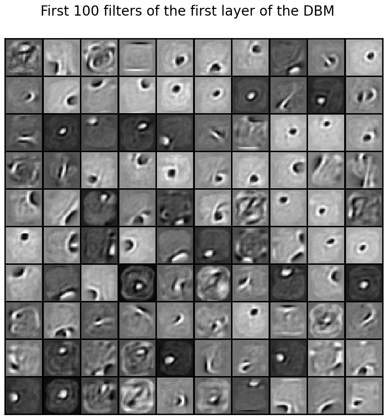

# Artificial Neural Networks and Deep Learning

## 4. Genrative Models

## Section 4.1.1 : Energy-Based Models: Restricted Boltzmann Machines
### Q1. In the restricted boltzmann machine (RBM) script, the training algorithm refers to the pseudo-likelihood. Why is that? What is the consequence regarding the training of the model?
### Section 4.1.1 : Energy-Based Models: Restricted Boltzmann Machines

#### Q1. In the restricted Boltzmann machine (RBM) script, the training algorithm refers to the pseudo-likelihood. Why is that? What is the consequence regarding the training of the model?

1. **Intractable Likelihood Calculation**:
    - The goal of RBM training is to maximize the log-likelihood of the training data, ahcieved by learning over the gradient of the log-likelihood, or logrithmic of joint distribution $P_{model}(v, h; \theta)$. 
    - The exact maximum log-likelihood, characterized by an energy function $ E(v, h; \theta) = -v^TWh - b^Tv - a^Th $ defining the joint configuration of visible units $ v $ and hidden units $ h $ and a partition function $ Z(\theta) = \sum_v \sum_h \exp(-E(v, h; \theta)) $ denoting the sum of the exponentiated negative energies over all possible configurations of the visible and hidden units, involves calculating the derivatives of the logrithmic of joint distribution $P_{model}(v, h; \theta) = \frac{1}{Z(\theta)} \exp(-E(v, h; \theta)) $ that is interperted as the expectation difference between data-dependent expection with respect to data distribution $P_{data}(h, v; \theta)$ and model's expectation $P_{model}(v, h; \theta)$. 
    - However, this exact maximum likelihood learning is intractable for large models owing the exponentially growing number of terms.
2. **Solution**: 
    - To circumvent this, the Contrastive Divergence (CD) algorithm with conditional distributions, or conditional probabilities, factorized as
      $
      P(h|v; \theta) = \prod_j p(h_j|v)
      $
      $
      P(v|h; \theta) = \prod_i p(v_i|h)
      $
    using the sigmoid activation function, is used as an approximatoin, where the update rule for the weight matrix $ W $ is given by
    $
    \Delta W = \alpha (E_{P_{data}}[vh^T] - E_{P_T}[vh^T])
    $
    where $ P_T $ is the distribution obtained after running a Gibbs sampler for $ T $ steps.
    - This alternative objective function, known as the pseudo-likelihood, is used to approximate the log-likelihood of the data, and is defined as
    $
    \log P(v_i|v_{-i}; \theta) = \sum_i \log P(v_i|v_{-i}; \theta)
    $
    where $ v_{-i} $ denotes the visible units excluding the $ i $-th unit.
    
    - The pseudo-likelihood training algorithm simplifies the computation of the log-likelihood, avoiding the intractable calculation of the partition function $ Z(\theta) $, and focuses on the local dependencies between the visible units, rather than the global structure of the data. This allows for more efficient training, but at the cost of an approximation that might not capture all dependencies in the data as accurately as the true likelihood.

### Q2. What is the role of the number of components, learning rate and and number of iterations on the performance? You can also evaluate the effect it visually by reconstructing unseen test images.

#### Configuration Results:
- **Configuration 1**: n_components = 20, learning_rate = 0.01, n_iter = 10
- **Configuration 2**: n_components = 10, learning_rate = 0.01, n_iter = 10
- **Configuration 3**: n_components = 10, learning_rate = 0.001, n_iter = 10
- **Configuration 4**: n_components = 10, learning_rate = 0.001, n_iter = 30
- **Configuration 5**: n_components = 50, learning_rate = 0.001, n_iter = 30

1. **Effect of `n_components` (Number of Hidden Units)**:
   - **Configurations 1 and 2**: Increasing the number of hidden units from 10 to 20 (Configuration 2 to Configuration 1) significantly improves the pseudo-likelihood, indicating more hidden units allows for capturing more complex patterns in the data.
   - **Configuration 5**: Further increasing to 50 hidden units (Configuration 5) shows even better performance, suggesting that a higher number of hidden units can lead to better model capacity and improved performance.

2. **Effect of `learning_rate`**:
   - **Configurations 2 and 3**: A higher learning rate of 0.01 (Configuration 2) shows better performance compared to a lower learning rate of 0.001 (Configuration 3). The pseudo-likelihood decreases more significantly with a higher learning rate, indicating faster convergence with limited number of iterations. However, a higher learning rate may also lead to overshooting the optimal parameters.

3. **Effect of `n_iter` (Number of Iterations)**:
   - **Configurations 3 and 4**: Increasing the number of iterations from 10 to 30 (Configuration 3 to Configuration 4) improves the pseudo-likelihood slightly. This shows that more iterations allow the model more time to converge, but the improvement might be diminishing.
   - **Configuration 5**: With a larger number of hidden units, the number of iterations shows a significant impact, as seen in the continuous improvement in pseudo-likelihood even at 30 iterations.

The observations indicaes that the number of hidden units serve as the dominant factor in improving model performance, followed by the learning rate and number of iterations. While a lower learning rate in general may suggest avoidance in overshooting the optimal parameters, it is essential that such configuration would reqruie more training iteratoins allowing for the optimaml convergence. Without increment in number of hidden units, increment in number of iterations may not necessarily improve the model performance.

### Q3. Change the number of Gibbs sampling steps. Can you explain the result?

Gibbs sampling is a technique used in the Contrast Divergence (CD) algorithm delineated in $Q1$, where the model is trained by sampling from the model distribution using Markov Chain Monte Carlo (MCMC) methods that iteratively updates the states of the visible and hidden units to draw samples from the joint distribution. The number of Gibbs sampling steps determines the number of iterations the sampler runs to approximate the model distribution. 

With Gibb steps set to 50, the generated images are noisy such that the digits are vaguely recongnizable, indicating insufficient iterations to fully explore the state space.
With 100 steps, the quality of the generated images significantly improves, which result aligns with the learned expecation where increment in steps would results in a more comprehensive representation of data distribution. 
Finally, when validated with 200 steps,  distinct digits generated can be observed, indicating a closer approximation learned by the sampler to represent the true distribution. 

### Q4. Use the RBM to reconstruct missing parts of images. Discuss the results.
The RBM attempts to fill in the missing parts, characterized by variables `start_row_to_remove` and `end_row_to_remove`, based on the learned distribution across the number of Gibbs steps `reconstruction_gibbs_steps` from the training data. 

To evaluate the performance of RBM, the `end_row_to_remove` was initially set to `0` for emperically determining with which `number of gibbs steps`, or `reconstruction_gibbs_steps` can the RBM reconstruct the missing parts accurately, which `number of gibbs steps` was found to be `49`.

 
<em>Fig.1 : Reconstructed digits with RBM gibbs steps of 49 </em>

Then, the `end_row_to_remove` was incremented stepwise to explore the limit of RBM's structure and patterns inference ability in given configuration of `100` hidden units, `0.01` learning rate, and `30` iterations. The model can accurately reconstruct the missing parts when `6` rows are removed and yet post `7` rows, the reconsutruction quality degraded, and at last completely failed to reconstruct when `20` rows were removed even with `number of gibbs steps` increased to `200`.

### Q5. What is the effect of removing ore rows in the image on the ability of the network to reconstruct? What if you remove rows on different locations (to, middle...)?

The reconstruction results are less likely to be affected if the removed sections are less critical to the overall shape of the digit. For a less affected removal instance owing to the still existence of the representative section with respect to the digit outline, four rows of removal in the top section for digits `7` or `9` would still allow a fair reconstruction as the lower parts contribute significantly to their shape. For digits such as `4`, `5`, or `6`, removing rows from the middle is often more detrimental since there exist a disruptive continuity of the digit's structure, leading to poorer RBM inference.

## Section 4.1.2: Energy-Based Models: Deep Boltzmann Machines

### Q1. load the pre-trainned Deep Boltzmann Machine (DBM) model that is trained on the MNIST dataset. Show the filters (interconnection weights) extracted from the previously trained RBM and the DBM, what is the difference? Can you explain why the difference between filters of the first and second layer of the DBM?

  

    
    <figcaption>Fig.2 - RBM Filters</figcaption>
  

  

     
    <figcaption>Fig.3 - DBM First Layer Filters</figcaption>
  

  

     
    <figcaption>Fig.4 - DBM Second Layer Filters</figcaption>
  

1. **Filters Extracted by the RBM and the 1st layer Filters Extracted by the DBM**:
    In grayscale, the filters in the DBM exhibit features in general with higher contrast. While the intensity of each pixel corresponds to the weight value, darker shades represent negative weights, lighter shades represent positive weights, and mid-gray represents weights close to zero, the DBM filters, with comparatively more darker shades exhibited in the filter indicating high negative weights in conjunction with high intensity features indicating high positive weights located in the filters, presents a significant potential in gradient descent optimization for edge detection compared to the generally-mid-gray RBM filters (Fig.2). Filters in the first layer of a DBM also capture basic features but with more variation and detail compared to RBM filters. 
2. **Filters Extracted by the 2nd Layer of the DBM**:
    Filters across different layers capture features at varying levels of abstraction owing to the hierarchical architecture of the model. Observed from Fig.3 and Fig.4, the first layer consist of filters with a largest shade cluster lighter than the second layer filters. This indicates the function of the first layer filters is to capture localized edge- and corner- like features in the region, which distinct patterns can be directly interpreted as parts of the input images, resembling stroke-like or edge-detecting features. 
    
    The second layer filters are more abstract and complex, capturing higher-order patterns in a global extend by integrating multiple low-level features. The second layer filters exhibit more intricate and abstract patterns, with darker shades, or negative wieghts covering the a specified round-shaped region, presumably where the digit distinctive outline is located at, with a contrastive light shades covering the reamining corner of the filters. This suggest a more complex broader area pattern learning and inter-local-feautres relationship learning are conducted at the second layer, essential for understanding the broader context and finer details within the data. Some filters in the second layer indicates a notable high intentisty circular small region in varied positions accross filters, which could be interpreted as the prominent feature detection of the digit's distinctive outline.

### Q2. Sample new images from the DBM. Is the quality better than the RBM from the previous exercise? Explain. 
The images from the DBM are of higher quality compared to the RBM due to the deeper architecture of the DBM, exhibiting highly distinguishable digits outline and notable digit prominent features that is clearer and more coherent compared to those generated by a single-layer RBM. The multi-layer structure of the DBM enables the learning of data hierarchical representations. According to the previous discussion that the first layer serves to captures low-level features such as edges and textures, while subsequent layers aims to capture higher-level abstractions and complex patterns, with more inter-assocaited intricated features learned across layers the DBM is destined to generate more realistic and detailed images compared to the single-layer, local dependency capturing RBM.

### Section 4.2: Generator and Discriminator in the Ring: Generative Adversarial Networks (GANs)
### Q1. Explain the different losses and results in the context of the GAN framework.

In the framework of Generative Adversarial Networks (GANs) framework comprises two neural networks: the generator and the discriminator. These networks are trained simultaneously in a two-player minimax game-theoretic, or zero-sum game, manner. Objectives of the generator and the discriminator netowrks competes against each other as adversaries. While the generator aims to, from the provided trainning data, produce fake and yet realistic data samples, whereas discriminator pose to distinguish between real data samples and those generated by the generator. As illustrated in the slides, the competing process facilitates a gammic zero-sum game implementatoin, referred to as minimax GAN, as the generator aims to minimize the value of value function $ v(\theta^G, \theta^D) $, while the discriminator aims to maximize the value function as its determined payoff, resulting in:

$ G^* = \arg \min_G \max_D v(G, D) $

In the default setting, the value function $ v(\theta^G, \theta^D) $ is expressed as:

$ v(\theta^G, \theta^D) = \mathbb{E}_{x \sim p_{\text{data}}} [\log D(x)] + \mathbb{E}_{z \sim p_z} [\log (1 - D(G(z)))] $

To satisfy respective purposes in the traditional minimax game where the generator aims to minimize while the discriminator aims to maximize the value function, objective function for generator and discriminator are defined as follows:

$ J^{(G)}(G) = \mathbb{E}_{z \sim p_z} [\log (1 - D(G(z)))] $

$ J^{(D)}(D) = \mathbb{E}_{x \sim p_{\text{data}}} [\log D(x)] + \mathbb{E}_{z \sim p_z} [\log (1 - D(G(z)))] $

It is worth highlighting that in practical terms, adjustments to mitigate issues of vanishing gradients imposed by $ D(x) $ reaching the equilibrium of the zero-sum game, referred to as the saddle points was made. Such that the generator objective was instead denoted as the non-saturating GAN objective function:

$ J^{(G)}(G) = -\mathbb{E}_{z \sim p_z} [\log D(G(z))] $

and the corresponding loss function for the generator is:

$ L_G = -\left( \mathbb{E}_{z \sim p_z} [\log D(G(z))] \right) $

Here, the generator tries to maximize $\log D(G(z))$, which is equivalent to minimizing $-\log D(G(z))$, such that $D(G(z))$ should be as large as possible, interpreted as that the discriminator will classify the generated data $G(z)$ as real with high probability. This modification aims to stabilize the training process by ensuring that the generator receives stronger gradients even when the discriminator's performance is good, addressing issues associated with vanishing gradients in the traditional minimax GAN.

The discriminator, on the other hand, aims to maximize the probability of correctly classifying real and fake data, such that the discriminator objective function is formulated as:

$ J^{(D)}(D) = \mathbb{E}_{x \sim p_{\text{data}}} [\log D(x)] + \mathbb{E}_{z \sim p_z} [\log (1 - D(G(z)))] $

where the corresponding loss function for the discriminator is:

$ L_D = -\left( \mathbb{E}_{x \sim p_{\text{data}}} [\log D(x)] + \mathbb{E}_{z \sim p_z} [\log (1 - D(G(z)))] \right) $

In the context of the algorithm from Goodfellow et al. (2014), the discriminator's loss can be broken down into two parts:
1. The loss for the real samples:
   $ L_{D,\text{real}} = -\mathbb{E}_{x \sim p_{\text{data}}} [\log D(x)] $
2. The loss for the fake samples:
   $ L_{D,\text{fake}} = -\mathbb{E}_{z \sim p_z} [\log (1 - D(G(z)))] $

Therefore, the total discriminator loss $ L_D $ is:
$ L_D = L_{D,\text{real}} + L_{D,\text{fake}} $

where both of $L_{D,\text{real}}$ and $L_{D,\text{fake}}$ should be minimized and approaching $0$ as the training progresses such that in the perspective of discriminator, $D(G(z))$ should be as close to zero as possible, indicating the generated data is classified as fake, and $D(x)$ should be as close to one as possible, indicating the real data is classified as real.

Reflected on the loss curve, the generator's loss shall increase over time, while the discriminator's loss shall decrease, indicating the generator's improving ability to deceive the discriminator, making it more challenging for the discriminator to differentiate between real and fake data as indicated in Fig.4. The training process is expected to progress smoothly, indicating a stable training process without significant oscillations or divergence, a common issue in GAN training.

After sufficient training, the generator distribution $ p_G $ becomes indistinguishable from the real data distribution $ p_{\text{data}} $. At this equilibrium, the discriminator cannot differentiate between real and fake samples, resulting in $ D(x) = \frac{1}{2} $ for any sample $ x $. One cannot further improve since $ p_{\text{G}} = p_{\text{data}} $, reaching plateau where the generator has learned to generate realistic data samples.

### Q2. What would you expect if the discriminator performs proportioanlly much better than the generator?
If the discriminator performs significantly better than the generator, several issues can arise, affecting the training dynamics and the quality of the generated data. The discriminator's performance can be considered too strong when it can easily distinguish between real and fake data with high confidence. This imbalance in performance indicates a calssification accurary with high confidence of $D(x) \approx 1$ for real data and $D(G(z)) \approx 0$ for generated data, leading to diminishing gradients for the generator. Suppose a batch of $m$ ,generator updates by decending its stochastic gradient:
$
  \nabla_{\theta^G} \frac{1}{m} \sum_{i=1}^m \log \left(1 - D(G(z^{(i)}))\right)
$

If $D(G(z)) \approx 0$, such vanishing gradients for the generator yield the gradients degrade, leading to the inability of generator to learn and improve, adverserally enforcing constant poor-quality samples generation.

### Q3. Discuss and illustrate the convergence and stability of GANs.

 
<em>Fig.4: GAN loss curve </em>

Configured with a `latent dimension` of `20`, a `batch size` of `512`, and a `learning rate` of `1e-3`, the empirical results detail the average losses for the generator and discriminator over `70` epochs. Key observations include:

#### Theoretical Illustration of GAN Convergence

1. **Adversarial Pair Near Convergence**:
   - $ p_G $ approximates $ p_{\text{data}} $, and the discriminator $ D $ achieves partial accuracy in classifying real versus fake data.

2. **Discriminator Training**:
   - The discriminator is optimized to distinguish between real and fake samples, converging to:
     $ D^*(x) = \frac{p_{\text{data}}(x)}{p_{\text{data}}(x) + p_G(x)} $

3. **Generator Updates**:
   - The generator is updated based on the discriminator's feedback, producing samples $ G(z) $ that are increasingly realistic.

4. **Equilibrium State**:
   - At equilibrium, $ p_G \approx p_{\text{data}} $, and the discriminator's output for any sample $ x $ is:
     $ D(x) = \frac{1}{2} $

#### Empirical Training Process and Results

The provided GAN implementation includes the following key elements:

1. **Network Architecture**:
   - Generator: Fully connected layers with Leaky ReLU and Tanh activations.
   - Discriminator: Fully connected layers with Leaky ReLU and Dropout, followed by a sigmoid activation.

2. **Training Procedure**:
   - Discriminator updates:
     $
     \nabla_{\theta^D} \frac{1}{m} \sum_{i=1}^m \left[ \log D(x^{(i)}) + \log (1 - D(G(z^{(i)}))) \right]
     $
   - Generator updates:
     $
     \nabla_{\theta^G} \frac{1}{m} \sum_{i=1}^m \log (1 - D(G(z^{(i)})))
     $

#### Empirical Results

The training loss curves for the generator and discriminator show the following trends:

1. **Initial Stages**:
   - **Epoch 1**: Average loss generator vs. discriminator: 0.829 vs. 0.698
   - **Epoch 2**: Average loss generator vs. discriminator: 0.956 vs. 0.686

2. **Mid Stages**:
   - **Epoch 10**: Average loss generator vs. discriminator: 1.36 vs. 0.571
   - **Epoch 20**: Average loss generator vs. discriminator: 1.99 vs. 0.429

3. **Later Stages**:
   - **Epoch 30**: Average loss generator vs. discriminator: 2.22 vs. 0.396
   - **Epoch 50**: Average loss generator vs. discriminator: 2.86 vs. 0.3
   - **Epoch 70**: Average loss generator vs. discriminator: 3.08 vs. 0.253

In the context of convergence, both the generator and discriminator losses suggest a movement towards equilibrium corresponding to the theoretical expectation $ p_G \approx p_{\text{data}} $. The discriminator's loss decreases, showing improvement in classification, while the generator's loss increases but stabilizes, indicating that the generator is improving in producing realistic samples. Additionally, the smooth progression of both losses as indicated in Fig.4 without significant oscillations or divergence indicates a stable training process. Adjustments to learning rates and regularization techniques contribute to this stability.

### Q4.  Explore the latent space and discuss.
Three aspects of the latent space are explored: latent dimension, interpolation in latent space (traversing latent space), and the Sampling and Visualizing Multiple Latent Vectors.

Latent dimension was first explored empirically by comparing `latent_dim = 10` and `latent_dim = 20` with both `num_epochs = 70`, results tabulated below:

  | Latent Dimension | Epoch 1 Generator Loss | Epoch 1 Discriminator Loss | Epoch 25 Generator Loss | Epoch 25 Discriminator Loss | Epoch 50 Generator Loss | Epoch 50 Discriminator Loss |
  |------------------|------------------------|----------------------------|-------------------------|-----------------------------|-------------------------|-----------------------------|
  | 10               | 0.818                  | 0.705                      | 1.76                    | 0.463                       | 2.46                     | 0.354                       |
  | 20               | 0.829                  | 0.698                      | 2.13                    | 0.413                       | 2.86                     | 0.3                         |

This reveals that increment in latent dimension from `10` to `20` results in a higher generator loss, indicating that the generator is producing more realistic samples. The discriminator loss also decreases, suggesting that the discriminator is finding it more challenging to differentiate between real and fake data, which is a positive sign of the generator's improvement.

Interpolation in latent space, or discussed in the lecture as Traversing the latent space, was conducted by linearly interpolating between two latent vectors with parameter `lambda`. The generated images as illustrated in Fig.5, showing a smooth transition between number `5` and `3`. The interpolation indicates a semantically coherent and realistic morphing, or transition capability, of the generator of GAN in between latent vectors in the latent space.

 
<em>Fig.5: Latent vectors interpolation </em>

Sampling multiple latent vectors, or discussed in the lecture as Sampling from the latent space, was conducted by randomly sampling multiple latent vectors and accordinly generating corresponding fake images. The generated images as illustrated in Fig.6, while showing the ability of generator producing relatively diverse and higher-quality samples and demostrating zero memory dependency on the training set for new image generation, latent code inference limitation of the GAN model constrained by imporsing focused on the models of the real-data distruction is inevitable indicated if compared to Variational Autoencoders (VAEs) or plain Autoencoders, which have an encoder.

 
<em>Fig.6: Latent vectors Sampling</em>

### Q5. Try the CNN-based backbone and discuss.
CNN-based GANs, or Deep convolutional GAN (DCGAN), compared to the fully connected GANs, as disucessed in lecture, demonstrate a more realistic and diverse image generation capability well-suited to the application of Large-scale Scene Understanding. As DCGAN generator leverages a hierarchical structure of convolutional layers, it captures the distribution projected small spatial extent convolutional represetnations with feature maps, recognizing local patterns, textures, and dependenceis. Exploiting the aforementioned properties of convoltuional networks, the extracted feature maps are then upsampled, deconvoluted, expanding images from features to generate high-quality images. Conversely, the discriminator, performs an inverse operation, downsampling the input images to extract features, and classifying the images as real or fake.

### Q6. What are the advantages and disadvantgaes of GAN-models compared to other generative models, e.g. the auto-enocder family or diffusion models? Think about the conceptural aspects, the quality of the results, the training considerations, etc.

GANs with other prominent generative models, such as autoencoders and diffusion models, considering conceptual aspects, quality of results, and training considerations are addressed below:

The advantgaes of GANS, given the adversarial architecture such that the generator is implicitly guided by the discriminator, facilitates a realistic data generation by the discriminator-feedback-driven generator without explicitly modeling the data distribution.. This two-player zero-sum game nature of GAN model enables highly detailed and high-fidelity output which performance often surpass the quality of outputs from other generative models, especially when in conjunction with CNN-based backbone that the spatial pattern and texture learning advantages of convolutional layers are exploited, deriving a diversed architectures of GANs, such as DCGAN, Conditional GAN, Auxiliary Classifier GAN, InfoGAN, CycleGAN, StyleGAN, etc.

Howeber, disadvantages of GANs are also notable, such as the training instability resulting from vanishing gradients, resource-intensive yielding from database-distribution-based training and database-distribution-dependent inference nature requiring normal distributed large amounts of data. Additioanlly, as discussed in previous section the lack of underlying data distribution information and the intractablility of exact likelihood owing to the lack of data density estimation  makes it challenging to evaluate the likelihood of the generated samples.

Conversely, autoencoders, such as Variational Autoencoders (VAEs), characterized by amortized variational posterior, transfomring the problem into an Evidence Lower Bound optimization problem (ELBOW maximization), encodes the latent distribution in an encoder network and reconstruct the probalistic latent elements in a decoder network such that variations in the data distribution can be properly represented in the generated data. As the data variational distributions are modeled and parameterized for variational inference, VAEs provide a structured latent spac for utilizations, enabling a comparably stable training and more diversified sample generation stuiable for latent space interpolation and interpretable. However, VAEs often produce less detailed images compared to GANs. 

In the context of Diffuesion Models that generate data by reversing a diffusion process and gradually transforming noise into data samples, the series of iterative steps nature in the generation process, while promising in higher-fidelity which often surpass performance of GANs, require extensive computational resources and time for training. 

## Section 4.3: An Auto-Encoder with a Touch: Variational Auto-Encoders (VAEs)
### Q1. In practice, the model does not maximize the log-likelihood but another metric. Which one? Why is that and how does it work?

### Q2. In particular, what similarities and differences do you see when compared with stacked auto-encoder from the previous assignment? What is the metric for the reconstruction error in each case?
### Q3. Explore the latent space using the provided code and discuss what you observe.
### Q4. Compare the generation mechanism to GANs. You may optionally want to consider similar backbones for a fair comparison. What are the advantages and disadvantages?

## Section 4.4: (Optional) Generation and Creativity
- In this section, the goal is to create a practical generative model from scratch. Don’t hesitate to base yourself on the codes given in the previous sections. Choose a dataset of your liking, a model and train it.
- Discuss all your design and training choices thoroughly as well as the obtained results.

## Discussion Points

## Conclusion
