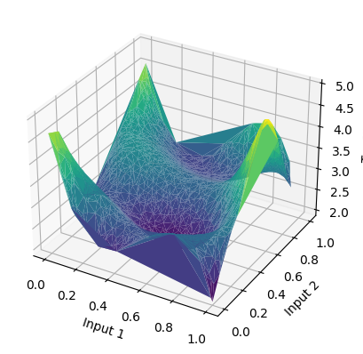

# Artificial Neural Networks and Deep Learning

## 1. Exploring Neural Networks for Regression and Classification

### Objective

In this lab session, we delve into the mechanisms of neural networks for regression and classification tasks, emphasizing training methods, generalization, and optimization algorithms which concepts are presented in section 1.3 "In the Wide Jungle of the Training Algorithms" and 1.4 "A Personal Regression Exercise."

### Introduction

This report investigates various gradient-based optimization algorithms and their impact on the training and generalization of neural models. Additionally, we present a hands-on experiment in approximating a nonlinear function using a neural network tailored to a unique dataset, highlighting the intricacies of model selection and evaluation.

### Methodology

The first part of our study scrutinizes different optimization algorithms using PyTorch implementations. We examine the role of noise in optimization processes, compare vanilla gradient descent with its stochastic and accelerated variants, assess the influence of network size on optimizer selection, and distinguish between epochs and time for algorithm speed evaluation.

In the second part, we tackle a regression problem, approximating an unknown nonlinear function based on a given dataset of 13,600 datapoints. Our approach involves constructing a personal dataset from five nonlinear functions, designing a neural network architecture, and evaluating its performance on a separate test set.

## Section 1.3: A small model for a small dataset

- **Answer with plots and tabular numerical data**

### Q1. What is the impact of the noise parameter in the example with respect to the optimization process?

Idea: define a list of noise and find online if there is a way to evaluate if the noise is too large compared to input. Is there a way to quantify the relationship between noise to signal ratio, and the impact on the optimizer?

The impact of noise can be quantified by listing a selection of noise, calculating for each selection the signal-to-noise ratio, fitting the model given the signal integrated with noise, and plotting the training-validation loss curve and learning curve.

- **SNR table**

   | Noise | SNR [dB]        | Residual    |
   |-------|-----------------|-------------|
   | 0.1   | tensor(9.7257)  | tensor(0.0106) |
   | 0.3   | tensor(0.5533)  | tensor(0.0879) |
   | 0.9   | tensor(-8.9133) | tensor(0.7776) |
   | 1.0   | tensor(-10.1901)| tensor(1.0433) |
   | 1.3   | tensor(-12.3810)| tensor(1.7278) |
   | 1.6   | tensor(-14.2371)| tensor(2.6492) |
   | 1.9   | tensor(-15.4338)| tensor(3.4897) |
   | 2.0   | tensor(-15.9377)| tensor(3.9190) |

**Impact of Noise on Optimization:**
- **Increased Difficulty:** Higher noise levels in the data can make the optimization process more challenging. Noise introduces variability in the loss landscape, making it harder for the optimizer to find a clear path toward the minimum.
- **Risk of Overfitting:** With more noise, there's a greater risk that the model may overfit to the noisy data, capturing the noise as if it were a meaningful pattern. This reduces the model's ability to generalize to new, unseen data.

**Using LBFGS with Noisy Data:**
- LBFGS (Limited-memory Broyden-Fletcher-Goldfarb-Shanno) is an optimization algorithm designed for solving smooth and convex optimization problems and is particularly well-suited for quasi-Newton methods.
- **Sensitivity to Noise:** LBFGS, being a second-order optimization method, is more sensitive to the quality of the gradient information. Noise can affect the Hessian approximation (which LBFGS uses to guide its updates), potentially leading to less stable updates.
- **Adaptations:** Implementing mechanisms such as line search strategies (like 'strong_wolfe') helps LBFGS adapt its step size in response to the noise, attempting to ensure that each step improves the loss in a meaningful way, despite the noise.

**Hypothetical Outcomes and Visualizations:**
- **Training Loss Plot:** 

- **Squared Residuals:** The plot of squared residuals (the squared differences between predictions and actual values) would likely show higher values on average, indicating greater prediction error due to the noise.

### Experimental Result

1. **Training and Validation Loss**
   - Description: Track the training and validation loss over epochs. An increasing gap between training and validation loss might indicate overfitting, which can be exacerbated by noise.
   - Quantification: Calculate the difference or ratio between training and validation loss. A larger difference suggests that noise may be negatively impacting generalization.
   - **Results**:
   |     | Training error | Residual | Lowest loss | Best epoch | SNR [dB]  |
   |-----|----------------|----------|-------------|------------|-----------|
   | 0.1 | 0.006351       | 0.006351 | 0.006352    | 1999       | 12.424053 |
   | 0.3 | 0.054652       | 0.054652 | 0.054655    | 1999       | 5.529366  |
   | 0.9 | 0.480521       | 0.480521 | 0.480558    | 1999       | 2.698386  |
   | 1.0 | 0.615826       | 0.615826 | 0.615904    | 1999       | 2.443620  |
   | 1.3 | 1.058633       | 1.058633 | 1.058636    | 1999       | 2.283705  |
   | 1.6 | 1.632100       | 1.632100 | 1.632197    | 1999       | 2.244913  |
   | 1.9 | 2.265662       | 2.265662 | 2.265848    | 1999       | 2.367871  |
   | 2.0 | 2.524409       | 2.524409 | 2.524705    | 1999       | 1.954540  |
   
   ```python
   - We would expect to see potentially more fluctuations in the training loss over epochs with higher noise levels. The convergence might also be slower or less smooth compared to training on less noisy data.
   ```

2. **Predicted Surface vs. True Surface:** 
   ```python
   The predicted surface plot would likely show more deviation from the true underlying function due to the noise. This deviation would manifest as a less smooth surface or one that doesn't capture the true pattern as cleanly.
   ```
3. **Squared Residuals:** 
   The plot of squared residuals (the squared differences between predictions and actual values) would likely show higher values on average, indicating greater prediction error due to the noise.
   ```python
   squared residuals plot to be added
   ```
4. **Model Accuracy**
   - Description: Evaluate the model's accuracy (or other relevant metrics) on both the training set and an unseen test set.
   ```python
   F1 score to be added
   ```

### Q2. How does (vanilla) gradient descent compare with respect to its stochastic and accelerated versions?
#### Vanilla Gradient Descent
In the context of neural network training, **Vanilla Gradient Descent** refers to the simplest form of gradient descent optimization algorithm. It is a first-order iterative optimization algorithm for finding the minimum of a function. Here's a basic explanation:

- **Objective**: The goal of gradient descent is to minimize a loss function, which measures the difference between the predicted output of the neural network and the actual target values. The loss function landscape can be thought of as a surface with hills and valleys, where each point on this surface represents a particular set of model parameters (weights and biases), and the elevation represents the loss value for those parameters.

- **How It Works**: Vanilla gradient descent updates all model parameters simultaneously, taking steps proportional to the negative of the gradient (or approximate gradient) of the loss function with respect to those parameters. This is akin to descending down the surface of the loss function to find its minimum value, which corresponds to the most optimal model parameters.

- **Update Rule**: 
    The update rule for the parameters in gradient descent is given by:

    `θ = θ - η ∇_θJ(θ)`

    where:
    - `θ` represents the parameters of the model,
    - `η` is the learning rate (a small, positive hyperparameter that determines the size of the steps),
    - `∇_θJ(θ)` is the gradient of the loss function `J(θ)` with respect to the parameters.

- **Characteristics**:
    - The term "vanilla" indicates that this is the most basic form of gradient descent, without any modifications or optimizations like momentum or adaptive learning rates.
    - It involves a full computation of the gradient using the entire dataset, which makes it computationally expensive and slow for large datasets.
    - It can be slow to converge, especially in loss function landscapes that are shallow or have many plateaus, saddle points, or local minima.

#### Stochastic Gradient Descent (SGD)
In contrast, **Stochastic Gradient Descent (SGD)** and **Accelerated versions** (such as Momentum, Nesterov Accelerated Gradient, Adam, etc.) introduce various optimizations to improve the convergence speed, efficiency, or stability of the training process. For example, SGD updates the model parameters using the gradient computed from a randomly selected subset of the data (a mini-batch) rather than the entire dataset, significantly speeding up the computation and allowing for more frequent updates.

### Q3. How does the size of the network impact the choice of the optimizer?
The size of the neural network can indeed impact the choice of the optimizer. 

1. **Memory Usage**: Some optimizers require more memory because they need to store additional parameters or states. For example, Adam, RMSProp, and other adaptive learning rate methods store an exponentially decaying average of past gradients. This can be problematic for very large networks or for devices with limited memory.

2. **Convergence Speed**: For large networks, the speed of convergence becomes critical. Stochastic Gradient Descent (SGD) with momentum or adaptive learning rate methods like Adam can converge faster than vanilla SGD, which can be beneficial for large networks.

3. **Generalization**: Some research suggests that simpler optimizers like SGD may generalize better for larger networks, while adaptive methods might lead to overfitting. However, this can be problem-dependent and is still an active area of research.

4. **Computational Overhead**: Optimizers like Adam, RMSProp have additional computational overhead compared to SGD due to the calculation of moving averages of gradients or squared gradients. For large networks, this overhead can be significant.
### Experimental Result
In the experiment, we can compare the convergence speed and generalization performance of different optimizers (e.g., SGD, Adam, RMSProp) on networks of varying sizes. We can also measure the memory usage and computational time for each optimizer and network size combination to understand the practical implications of the choice. 
To evaluate the impact of network size on the choice of optimizer based on convergence speed and generalization performance, the code is modified to record the convergence speed exemplified by the best epoch number given different network sizes and optimizers.

   | Optimizer Number | Optimizer Type | Learning Rate | Momentum | Nesterov | Max Iter | Line Search Fn |
   |------------------|----------------|---------------|----------|----------|----------|----------------|
   | 1                | SGD            | 0.05          | -        | -        | -        | -              |
   | 2                | SGD            | 0.1           | -        | -        | -        | -              |
   | 3                | SGD            | 0.1           | 0.9      | True     | -        | -              |
   | 4                | Adam           | -             | -        | -        | -        | -              |
   | 5                | LBFGS          | 1             | -        | -        | 1        | strong_wolfe   |


   | Network Size | Optimizer 1 | Optimizer 2 | Optimizer 3 | Optimizer 4 | Optimizer 5 |
   |--------------|-------------|-------------|-------------|-------------|-------------|
   | 10           | 2445        | 2208        | 1985        | 2500        | 2499        |
   | 50           | 2475        | 2400        | 2465        | 2499        | 2500        |
   | 100          | 2359        | 2460        | 2430        | 2499        | 2500        |

```python
# Example code to record the best epoch number for different network sizes and optimizers
Explain the results
```

### Q4. Discuss the difference between epochs and time to assess the speed of the algorithms. What can it mean to converge fast ?
When evaluating the performance of optimization algorithms in training neural networks, both the number of epochs and the time taken are crucial metrics, but they measure different aspects of the learning process. Understanding the distinction between them is essential for accurately assessing algorithm speed and efficiency.

#### Epochs

- **Definition**: An epoch is a single pass through the entire training dataset. Completing one epoch means the algorithm has used every sample in the dataset once to update the model's parameters.
- **Convergence Speed**: In the context of epochs, convergence speed refers to the number of epochs required for an algorithm to reach a certain level of accuracy or to minimize the loss function to a predefined threshold. Fewer epochs needed for convergence generally indicate a faster learning algorithm, assuming all other factors are equal.
- **Evaluation Metric**: Using epochs as a metric allows us to assess the efficiency of the learning process in terms of dataset utilization. It provides insights into how quickly the model learns from the entire dataset.

#### Time

- **Definition**: Time refers to the actual duration taken by the algorithm to reach convergence, measured in units of time such as seconds or minutes.
- **Convergence Speed**: When considering time, convergence speed is about how quickly an algorithm can achieve a specified level of performance. This measure takes into account not only the efficiency of learning from the data (as measured by epochs) but also the computational complexity of the algorithm, including the time it takes to process each epoch.
- **Evaluation Metric**: Time as a metric provides a practical understanding of an algorithm's performance, especially in real-world applications where computational resources and time are limited. It includes the effects of implementation details, hardware efficiency, and algorithmic complexity.

#### Comparing Epochs and Time for Convergence

- **Epochs for Learning Efficiency**: Evaluating algorithms based on the number of epochs emphasizes the model's ability to learn from data. It abstracts away from computational aspects, focusing on the learning algorithm's theoretical efficiency. However, it doesn't account for the time each epoch takes, which can vary significantly between different algorithms or even different implementations of the same algorithm.
- **Time for Practical Efficiency**: Considering the time to converge provides a holistic view of an algorithm's efficiency, incorporating both the learning efficiency and the computational cost. It's particularly relevant in applied settings where time and computational resources are constraints.

#### Fast Convergence

- **In Terms of Epochs**: Fast convergence in terms of epochs means the algorithm requires fewer passes through the dataset to reach its convergence criteria. This can be indicative of a more efficient learning process but doesn't account for the computational cost per epoch.
- **In Terms of Time**: Fast convergence in terms of time means the algorithm reaches its convergence criteria more quickly in real time. This measure is influenced by both the number of epochs required and the computational efficiency of the algorithm.

#### Conclusion

Fast convergence can mean different things depending on whether we're discussing epochs or time. In practice, the best measure depends on the specific context and constraints of the application. For research or situations where the learning process itself is under scrutiny, epochs might be the more relevant metric. In contrast, for practical applications where computational resources and time are limited, the actual time to convergence is often more critical.

### Q5: A Bigger Model: Number of Parameters in the Model

The model's total number of parameters can be calculated by examining each layer's contribution. The formula to calculate the number of parameters for Conv2D and Dense layers is given by:

- **Conv2D Layers**: $(\text{kernel width} \times \text{kernel height} \times \text{input channels} + 1) \times \text{number of filters}$
- **Dense Layers**: $(\text{input units} + 1) \times \text{output units}$

Let's calculate the number of parameters for the provided model:

1. **First Conv2D Layer**: $(3 \times 3 \times 1 + 1) \times 32 = 320$
2. **Second Conv2D Layer**: $(3 \times 3 \times 32 + 1) \times 64 = 18,496$
3. **Dense Layer**: After flattening and max pooling, the calculation requires knowing the output size from the previous layer. Assuming the max pooling layers do not overlap, the dimension after two max pooling layers (each with a stride of 2) on a 28x28 image would be reduced to $7 \times 7$ for each of the 64 filters from the second Conv2D layer. Hence, $(7 \times 7 \times 64 + 1) \times 10 = 31,750$

The dropout layer does not add any parameters; it only acts during training by randomly setting a fraction of the input units to 0 at each update during training time to prevent overfitting.

To calculate the exact number of parameters, you could use the `model.summary()` method in Keras, which prints a summary representation of your model, including the number of parameters (trainable and non-trainable) at each layer and the total.

   <pre style="white-space:pre;overflow-x:auto;line-height:normal;font-family:Menlo,'DejaVu Sans Mono',consolas,'Courier New',monospace">
   ┏━━━━━━━━━━━━━━━━━━━━━━━━━━━━━━━━━┳━━━━━━━━━━━━━━━━━━━━━━━━━━━┳━━━━━━━━━━━━┓
   ┃<span style="font-weight: bold"> Layer (type)                    </span>┃<span style="font-weight: bold"> Output Shape              </span>┃<span style="font-weight: bold">    Param # </span>┃
   ┡━━━━━━━━━━━━━━━━━━━━━━━━━━━━━━━━━╇━━━━━━━━━━━━━━━━━━━━━━━━━━━╇━━━━━━━━━━━━┩
   │ conv2d_2 (<span style="color: #0087ff; text-decoration-color: #0087ff">Conv2D</span>)               │ (<span style="color: #00d7ff; text-decoration-color: #00d7ff">None</span>, <span style="color: #00af00; text-decoration-color: #00af00">26</span>, <span style="color: #00af00; text-decoration-color: #00af00">26</span>, <span style="color: #00af00; text-decoration-color: #00af00">32</span>)        │        <span style="color: #00af00; text-decoration-color: #00af00">320</span> │
   ├─────────────────────────────────┼───────────────────────────┼────────────┤
   │ max_pooling2d_2 (<span style="color: #0087ff; text-decoration-color: #0087ff">MaxPooling2D</span>)  │ (<span style="color: #00d7ff; text-decoration-color: #00d7ff">None</span>, <span style="color: #00af00; text-decoration-color: #00af00">13</span>, <span style="color: #00af00; text-decoration-color: #00af00">13</span>, <span style="color: #00af00; text-decoration-color: #00af00">32</span>)        │          <span style="color: #00af00; text-decoration-color: #00af00">0</span> │
   ├─────────────────────────────────┼───────────────────────────┼────────────┤
   │ conv2d_3 (<span style="color: #0087ff; text-decoration-color: #0087ff">Conv2D</span>)               │ (<span style="color: #00d7ff; text-decoration-color: #00d7ff">None</span>, <span style="color: #00af00; text-decoration-color: #00af00">11</span>, <span style="color: #00af00; text-decoration-color: #00af00">11</span>, <span style="color: #00af00; text-decoration-color: #00af00">64</span>)        │     <span style="color: #00af00; text-decoration-color: #00af00">18,496</span> │
   ├─────────────────────────────────┼───────────────────────────┼────────────┤
   │ max_pooling2d_3 (<span style="color: #0087ff; text-decoration-color: #0087ff">MaxPooling2D</span>)  │ (<span style="color: #00d7ff; text-decoration-color: #00d7ff">None</span>, <span style="color: #00af00; text-decoration-color: #00af00">5</span>, <span style="color: #00af00; text-decoration-color: #00af00">5</span>, <span style="color: #00af00; text-decoration-color: #00af00">64</span>)          │          <span style="color: #00af00; text-decoration-color: #00af00">0</span> │
   ├─────────────────────────────────┼───────────────────────────┼────────────┤
   │ flatten_1 (<span style="color: #0087ff; text-decoration-color: #0087ff">Flatten</span>)             │ (<span style="color: #00d7ff; text-decoration-color: #00d7ff">None</span>, <span style="color: #00af00; text-decoration-color: #00af00">1600</span>)              │          <span style="color: #00af00; text-decoration-color: #00af00">0</span> │
   ├─────────────────────────────────┼───────────────────────────┼────────────┤
   │ dropout_1 (<span style="color: #0087ff; text-decoration-color: #0087ff">Dropout</span>)             │ (<span style="color: #00d7ff; text-decoration-color: #00d7ff">None</span>, <span style="color: #00af00; text-decoration-color: #00af00">1600</span>)              │          <span style="color: #00af00; text-decoration-color: #00af00">0</span> │
   ├─────────────────────────────────┼───────────────────────────┼────────────┤
   │ dense_1 (<span style="color: #0087ff; text-decoration-color: #0087ff">Dense</span>)                 │ (<span style="color: #00d7ff; text-decoration-color: #00d7ff">None</span>, <span style="color: #00af00; text-decoration-color: #00af00">10</span>)                │     <span style="color: #00af00; text-decoration-color: #00af00">16,010</span> │
   └─────────────────────────────────┴───────────────────────────┴────────────┘
   </pre>

   <pre style="white-space:pre;overflow-x:auto;line-height:normal;font-family:Menlo,'DejaVu Sans Mono',consolas,'Courier New',monospace"><span style="font-weight: bold"> Total params: </span><span style="color: #00af00; text-decoration-color: #00af00">34,826</span> (136.04 KB)
   </pre>

   <pre style="white-space:pre;overflow-x:auto;line-height:normal;font-family:Menlo,'DejaVu Sans Mono',consolas,'Courier New',monospace"><span style="font-weight: bold"> Trainable params: </span><span style="color: #00af00; text-decoration-color: #00af00">34,826</span> (136.04 KB)
   </pre>

   <pre style="white-space:pre;overflow-x:auto;line-height:normal;font-family:Menlo,'DejaVu Sans Mono',consolas,'Courier New',monospace"><span style="font-weight: bold"> Non-trainable params: </span><span style="color: #00af00; text-decoration-color: #00af00">0</span> (0.00 B)
   </pre>


### Q6: A Bigger Model: Replacing the Optimizer
- **Adam to SGD**: Adam is an adaptive learning rate optimizer that combines the best properties of the AdaGrad and RMSProp algorithms to provide an optimization algorithm that can handle sparse gradients on noisy problems. SGD (Stochastic Gradient Descent), on the other hand, maintains a single learning rate for all weight updates and the learning rate does not change during training. Changing Adam to SGD might slow down the convergence, and you might need to fine-tune the learning rate and possibly add momentum to achieve similar performance. Despite these differences, excellent performance can still be achieved with SGD, especially with careful tuning of its hyperparameters.

- **SGD to Adadelta**: Adadelta is an extension of AdaGrad aiming to reduce its aggressive, monotonically decreasing learning rate. It does so by restricting the window of accumulated past gradients to a fixed size. Adadelta does not require a default learning rate setting, making it easier to configure since it adapts over time. The particularity of Adadelta is that it seeks to reduce the learning rate's diminishing learning rates effect, making it more robust for various problems. However, its performance compared to Adam or SGD can vary depending on the task and specific model architecture.

Regarding the particularities of each optimizer and their impact on performance:

- **SGD** may require more careful tuning of the learning rate and may benefit from momentum to accelerate convergence in relevant directions. It's simpler but can be very effective with the right settings.

- **Adadelta** is designed to reduce the learning rate's aggressive decay and does not require a learning rate to be specified, making it easier to configure. It's adaptive and aims to address the diminishing learning rates problem of AdaGrad.

#### Experimental Result
- SGD can perform very well on a wide range of problems, especially with momentum. 
- Adadelta, being adaptive, might perform better in scenarios where the optimal learning rate changes over time.

   | Optimizer  | Test Loss | Test Accuracy |
   |------------|-----------|---------------|
   | ADAM       | 0.025648  | 0.9909        |
   | SGD        | 0.022971  | 0.9917        |
   | Adadelta   | 0.022916  | 0.9918        |

## Section 1.4: A Personal Regression Exercise
### Q1: Why spliting Training and Testing Dataset. Plot the surface associated to the training set.

The splitting should be done randomly to ensure that both datasets are representative of the overall data distribution.

1. **Explain the Point of Having Different Datasets for Training and Testing**: This is important to evaluate the generalization capability of the model. The training dataset is used to fit the model, i.e., to allow the model to learn the underlying patterns in the data. The testing dataset, which consists of unseen data, is used to assess how well the model performs on data it hasn't encountered before. If you only used a single dataset for both training and testing, you wouldn't be able to tell if the model had simply memorized the data (overfitting) or if it had learned to generalize from the patterns it had seen during training.

2. **Plot the Surface Associated to the Training Set**: Once the `T_new` target is constructed using your student number as weights for the different functions, you can plot the surface associated with the training set. This plot will visualize the new function that your neural network will try to approximate.
<p align="center">
  
  <br>
  <em>Figure: Surface associated to the Training Set.</em>
</p>

### Q2: The Neural Network Architecture Hyperparameters Tuning
Build and train your feedforward neural network. To that end, you must perform an adequate model selection on the training set. Investigate carefully the architecture of your model: number of layers, number of neurons, learning algorithm and transfer function. How do you validate your model ?

systematically explore a range of different model architectures, learning rates, and other hyperparameters to find the best performing model on your validation set. 

1. **Model Selection**: The model selection process involves experimenting with different hyperparameters to find the combination that yields the best performance on the training set. This includes:
   - **Number of Layers**: Experiment with different numbers of hidden layers and units in each layer to find the architecture that best captures the underlying patterns in the data.
   - **Learning Algorithm**: Try different optimization algorithms (e.g., SGD, Adam, RMSProp) and learning rates to find the one that converges most effectively.
   - **Transfer Function**: Experiment with different activation functions (e.g., ReLU, Sigmoid, Tanh) to find the one that best captures the non-linear relationships in the data.

In practice, you may want to use more sophisticated techniques and libraries designed for hyperparameter optimization, like `keras-tuner` or `scikit-learn`'s `GridSearchCV` for larger spaces of parameters.

2. **Validation**: To validate the model, you can use a separate validation set (distinct from the training and testing sets) to assess the model's performance during training. This can help you monitor for overfitting and ensure that the model generalizes well to unseen data. Additionally, you can use techniques like cross-validation to assess the model's performance across different subsets of the training data.

### Q3: The Neural Network Training and Testing
Evaluate the performance of your selected network on the test set. Plot the surface of the test set and the approximation given by the network. Explain why you cannot train further. Give the final MSE on the test set.

1. **Performance Evaluation**: After training the selected network on the training set, you can evaluate its performance on the test set. This involves using the trained model to make predictions on the test set and comparing those predictions to the true target values. Common metrics for regression tasks include Mean Squared Error (MSE), Root Mean Squared Error (RMSE), and R-squared.

2. **Surface Plot and Approximation**: Plot the surface of the test set and the approximation given by the network. This visual comparison can provide insights into how well the model captures the underlying patterns in the data.

3. **Training Limitations**: Explain why you cannot train further. This could be due to reaching a satisfactory level of performance, avoiding overfitting, or computational constraints.

4. **Final MSE**: Provide the final Mean Squared Error (MSE) on the test set as a quantitative measure of the model's performance.

### Q4: The Neural Network Regularization Strategies
Describe the regularization strategy that you used to avoid overfitting. What other strategy can you think of ?

1. **Regularization Strategy**: Regularization techniques like L1 and L2 regularization, dropout, and early stopping can be used to avoid overfitting. Describe the specific regularization strategy you used and how it helped improve the model's generalization performance.

2. **Other Strategies**: Discuss other strategies that can be used to avoid overfitting, such as data augmentation, batch normalization, and model ensembling.

